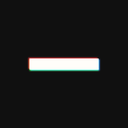
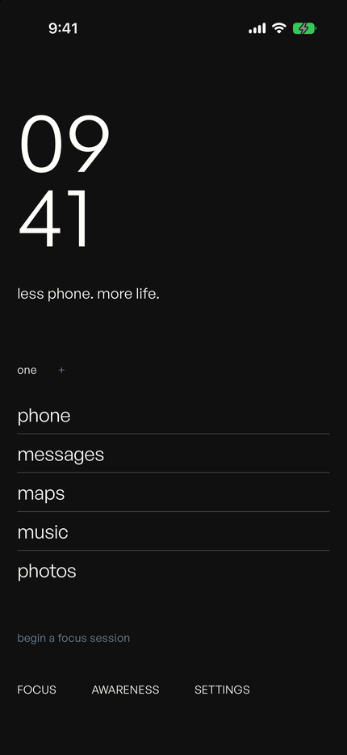
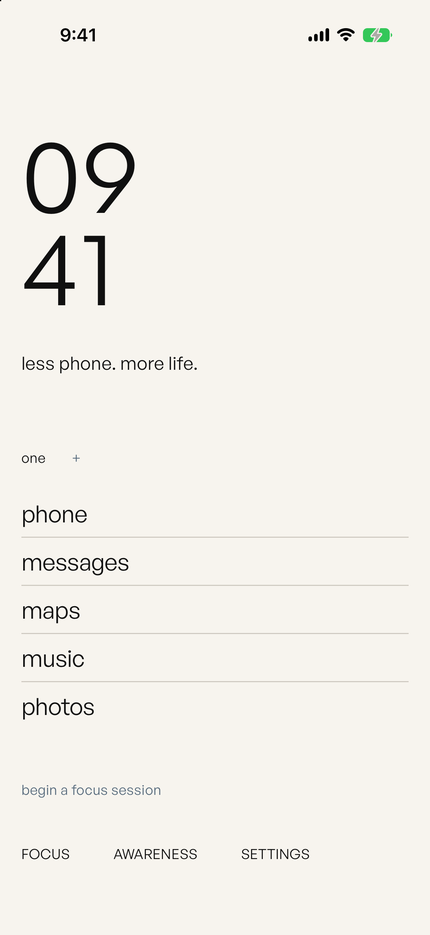
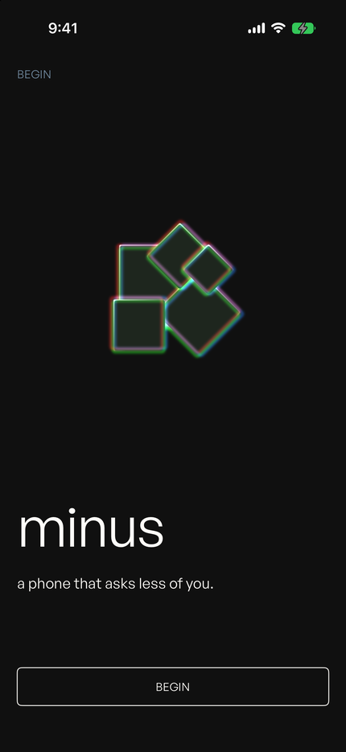
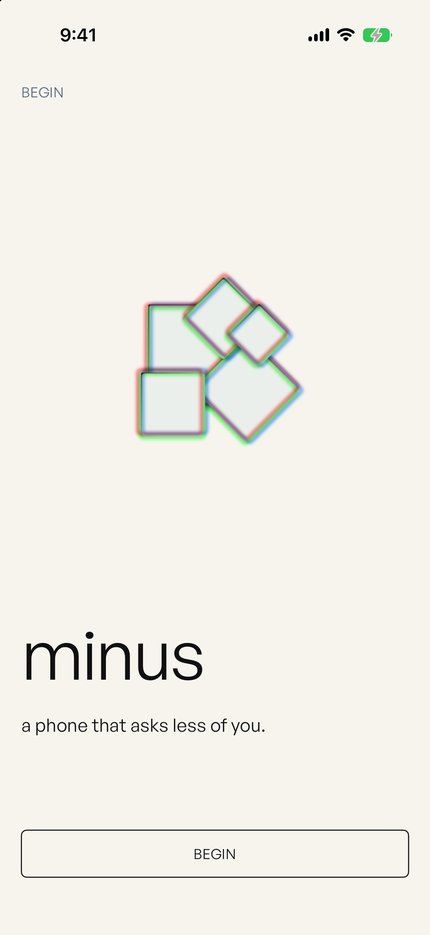
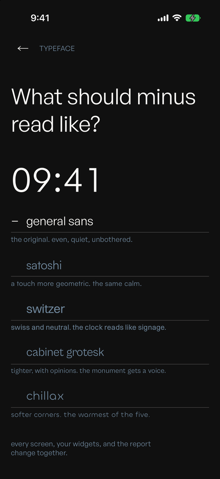
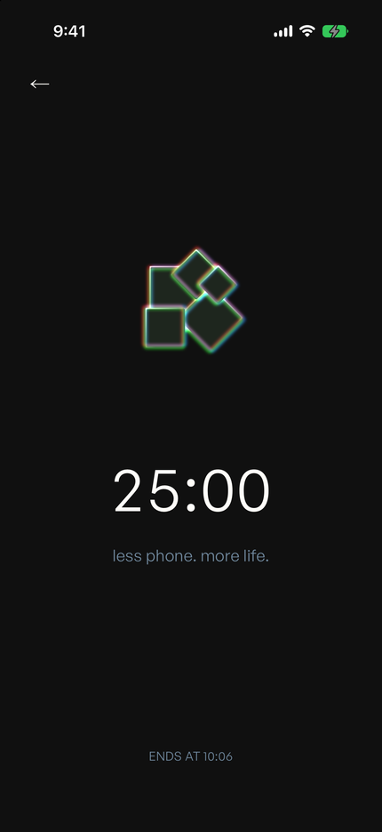

<p align="center">
  
</p>

<h1 align="center">minus</h1>

<p align="center">
  A digital-minimalism iOS app. A giant clock, your intention, the few apps you
  actually need, and real app blocking through Apple's Screen Time API when you
  choose to focus.
</p>

<table>
  <tr>
    <td></td>
    <td></td>
  </tr>
</table>

minus follows the phone: the void at night, paper in daylight. Every colour is
a pair resolved inside the token itself, so the app, both widgets and the
Screen Time report change together.

Design language: one typeface at a time, hierarchy from scale, zero shadows,
and a single chromatic voice (the prism artifact).

<table>
  <tr>
    <td></td>
    <td></td>
  </tr>
</table>

The prism is the same artifact on either ground, mirrored rather than
recoloured. Its cube sits a hair from the canvas both ways — black is 6% off
obsidian, white is 3% off paper — so the mass recedes and the dispersion is the
subject. One neon triad serves both: added, the channels sum toward white;
multiplied, they sink toward ink.

<table>
  <tr>
    <td></td>
    <td></td>
  </tr>
</table>

Which typeface is the user's call: five approved faces (General Sans, Satoshi,
Switzer, Cabinet Grotesk, Chillax — all Fontshare, ITF Free Font License),
picked in Settings and applied to the app, the widgets, and the report
together. Each row in the picker is set in the face it names. `MTypeface` owns
every PostScript name, and DesignGuard rule 8 fails the suite if any other font
name appears. The launch wordmark and the app icon are baked images and stay in
General Sans: a logotype is a logotype.

## Build

There is no checked-in Xcode project. `Minus.xcodeproj` is generated by
XcodeGen from `project.yml`, so a fresh clone has nothing to open until you
run step 2.

```bash
# 1. Your signing team and bundle id. MINUS_BUNDLE_ID must be an App ID you
#    actually own: it is interpolated into the bundle id, the URL scheme, the
#    entitlements, and group.$(MINUS_BUNDLE_ID), so a placeholder fails to
#    sign and the widget and monitor lose the app group.
cp Config/Secrets.example.xcconfig Config/Secrets.xcconfig

# 2. Generate the project. Required after clone AND after every project.yml edit.
xcodegen generate

# 3. Build.
xcodebuild -project Minus.xcodeproj -scheme Minus \
  -destination "platform=iOS Simulator,name=iPhone 17 Pro" build
```

Fonts are committed under `Minus/Resources/Fonts`, so nothing to fetch.
`./scripts/fetch_fonts.sh` re-downloads them from Fontshare if you need to
repair or add a family.

The simulator always runs against `MockScreenTimeService` — real shields
(FamilyControls) require a physical device with dev signing.

For an App Store upload, `cp Support/ExportOptions.example.plist
Support/ExportOptions.plist` and fill in your team; the real file is
gitignored.

## Reaching a screen without tapping there

Debug builds accept a staging vocabulary, which is how the UI tests and the
screenshot runs drive the app. Pass `-UITestMode` as a launch argument and set
any of these as environment variables:

| Variable | Values |
|---|---|
| `MINUS_STATE` | `fresh`, `onboarded`, `active`, `schedules`, `denied`, `noblock`, `noessentials`, `cards` |
| `MINUS_SCREEN` | `focus`, `awareness`, `settings`, `schedules`, `settings-cards`, `settings-card-detail`, `settings-custom`, `settings-blocked`, `settings-permission`, `settings-strictness`, `settings-typeface`, `settings-about`, `settings-guide`, `gallery` |
| `MINUS_FREEZE_TIME` | `HH:mm` (the clock stops there) |
| `MINUS_STRICTNESS` | `normal`, `friction`, `strict` |
| `MINUS_GOAL` | `hidden` |
| `MINUS_TYPEFACE` | `generalSans`, `satoshi`, `switzer`, `cabinetGrotesk`, `chillax` |
| `MINUS_BLOCK` | `stale` |
| `MINUS_SEARCH` | `stub`, `offline`, `empty` |
| `MINUS_LAUNCH` | `fail` |

```bash
SIMCTL_CHILD_MINUS_STATE=active SIMCTL_CHILD_MINUS_SCREEN=focus \
SIMCTL_CHILD_MINUS_FREEZE_TIME=09:41 \
  xcrun simctl launch --terminate-running-process booted com.example.minus -UITestMode
```

`MINUS_SCREEN=gallery` renders the whole design system plus every widget frame
in one scrolling sheet — the fastest way to see a type or motion change.

## Targets

Six: the app, `MinusWidget` (launcher + focus widgets), `MinusMonitor` (the
DeviceActivity extension that guarantees shields lift), `MinusReport` (the
Screen Time report rendered in the app's own typeface), and the two test
targets. See `ARCHITECTURE.md`.

## QA

`QA/feature-stories.csv` is the canonical feature/story matrix; evidence
screenshots live in `QA/evidence/` named `{ID}.png` (and `{ID}-fixed.png`
after a fix). See `docs/DEVICE-TESTING.md` for the on-device checklist.
